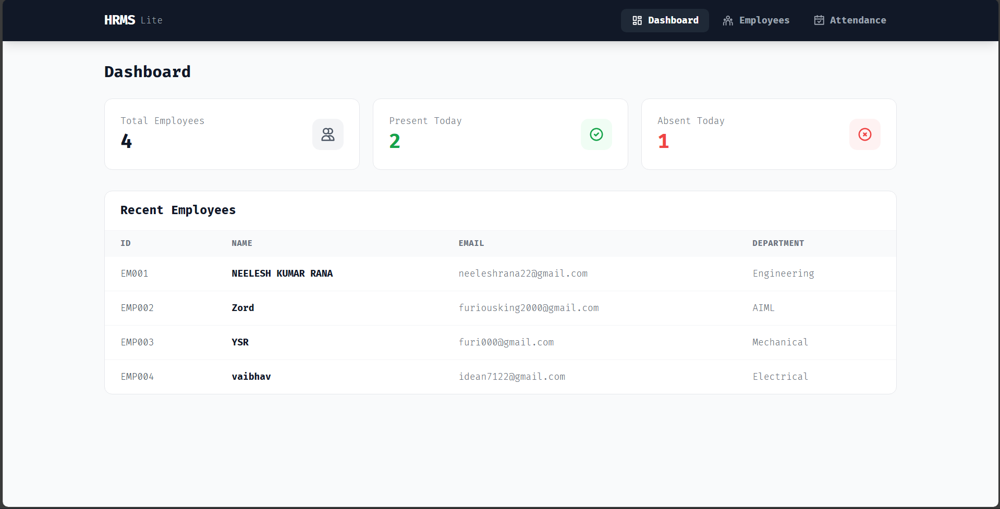

# HRMS Lite - Human Resource Management System

A full-stack web application for managing employees and tracking attendance, built with FastAPI (Python) and React.

## Screenshot



## Table of Contents

1. [Overview](#overview)
2. [System Architecture](#system-architecture)
3. [Database Design](#database-design)
4. [Tech Stack](#tech-stack)
5. [Project Structure](#project-structure)
6. [API Documentation](#api-documentation)
7. [Setup Instructions](#setup-instructions)
8. [Features](#features)
9. [Assumptions](#assumptions)
10. [Deployment Guide](#deployment-guide)

---

## Overview

HRMS Lite is a lightweight employee management system that allows administrators to:
- Add, view, and delete employee records
- Mark daily attendance (Present/Absent)
- View attendance history for each employee
- Monitor workforce statistics via dashboard

---

## System Architecture

### High-Level Architecture

```
┌─────────────────────────────────────────────────────────────────┐
│                         CLIENT LAYER                             │
│  ┌─────────────────────────────────────────────────────────┐    │
│  │                    React Frontend                        │    │
│  │  ┌──────────┐  ┌──────────┐  ┌──────────────────────┐   │    │
│  │  │Dashboard │  │Employees │  │     Attendance       │   │    │
│  │  │  Page    │  │  Page    │  │       Page           │   │    │
│  │  └──────────┘  └──────────┘  └──────────────────────┘   │    │
│  │                       │                                  │    │
│  │              ┌────────┴────────┐                        │    │
│  │              │   API Service   │ (axios)                │    │
│  │              │    (api.js)     │                        │    │
│  │              └────────┬────────┘                        │    │
│  └───────────────────────│─────────────────────────────────┘    │
└──────────────────────────│──────────────────────────────────────┘
                           │ HTTP/REST
                           ▼
┌─────────────────────────────────────────────────────────────────┐
│                        SERVER LAYER                              │
│  ┌─────────────────────────────────────────────────────────┐    │
│  │                   FastAPI Backend                        │    │
│  │                                                          │    │
│  │  ┌──────────────────────────────────────────────────┐   │    │
│  │  │                  main.py                          │   │    │
│  │  │            (CORS, Router Setup)                   │   │    │
│  │  └──────────────────────┬───────────────────────────┘   │    │
│  │                         │                                │    │
│  │  ┌──────────────────────┴───────────────────────────┐   │    │
│  │  │               Controllers (Routes)                │   │    │
│  │  │  ┌─────────────┐ ┌─────────────┐ ┌────────────┐  │   │    │
│  │  │  │  Employee   │ │ Attendance  │ │ Dashboard  │  │   │    │
│  │  │  │ Controller  │ │ Controller  │ │ Controller │  │   │    │
│  │  │  └─────────────┘ └─────────────┘ └────────────┘  │   │    │
│  │  └──────────────────────┬───────────────────────────┘   │    │
│  │                         │                                │    │
│  │  ┌──────────────────────┴───────────────────────────┐   │    │
│  │  │                Models (Pydantic)                  │   │    │
│  │  │  ┌─────────────────┐  ┌─────────────────────┐    │   │    │
│  │  │  │ EmployeeModel   │  │  AttendanceModel    │    │   │    │
│  │  │  └─────────────────┘  └─────────────────────┘    │   │    │
│  │  └──────────────────────────────────────────────────┘   │    │
│  │                         │                                │    │
│  │  ┌──────────────────────┴───────────────────────────┐   │    │
│  │  │              Config (database.py)                 │   │    │
│  │  │            MongoDB Connection Handler             │   │    │
│  │  └──────────────────────┬───────────────────────────┘   │    │
│  └─────────────────────────│───────────────────────────────┘    │
└────────────────────────────│────────────────────────────────────┘
                             │ PyMongo Driver
                             ▼
┌─────────────────────────────────────────────────────────────────┐
│                       DATABASE LAYER                             │
│  ┌─────────────────────────────────────────────────────────┐    │
│  │                   MongoDB Atlas                          │    │
│  │                                                          │    │
│  │    ┌──────────────────┐    ┌──────────────────┐         │    │
│  │    │   employees      │    │   attendance     │         │    │
│  │    │   Collection     │    │   Collection     │         │    │
│  │    └──────────────────┘    └──────────────────┘         │    │
│  │                                                          │    │
│  └─────────────────────────────────────────────────────────┘    │
└─────────────────────────────────────────────────────────────────┘
```

### Request Flow

```
User Action → React Component → API Call (axios) → FastAPI Endpoint
    ↓
FastAPI Controller → Pydantic Validation → MongoDB Operation
    ↓
MongoDB Response → Controller Response → React State Update → UI Render
```

---

## Database Design

### Entity Relationship Diagram

```
┌─────────────────────────────┐       ┌─────────────────────────────┐
│         EMPLOYEES           │       │        ATTENDANCE           │
├─────────────────────────────┤       ├─────────────────────────────┤
│ _id        : ObjectId (PK)  │       │ _id         : ObjectId (PK) │
│ employee_id: String (Unique)│◄──────│ employee_id : String (FK)   │
│ full_name  : String         │   1:N │ date        : String        │
│ email      : String (Unique)│       │ status      : String        │
│ department : String         │       │              (Present/Absent)│
│ created_at : DateTime       │       │ created_at  : DateTime      │
└─────────────────────────────┘       └─────────────────────────────┘
```

### Collections Schema

#### employees Collection
```json
{
  "_id": "ObjectId",
  "employee_id": "EMP001",
  "full_name": "John Doe",
  "email": "john@example.com",
  "department": "Engineering",
  "created_at": "2024-01-15T10:30:00Z"
}
```

#### attendance Collection
```json
{
  "_id": "ObjectId",
  "employee_id": "EMP001",
  "date": "2024-01-15",
  "status": "Present",
  "created_at": "2024-01-15T09:00:00Z"
}
```

### Indexes
- `employees.employee_id` - Unique index
- `employees.email` - Unique index
- `attendance.employee_id + attendance.date` - Compound unique index

---

## Tech Stack

| Layer | Technology | Purpose |
|-------|------------|---------|
| Frontend | React 18 | UI Components |
| Frontend | Vite | Build Tool & Dev Server |
| Frontend | React Router v6 | Client-side Routing |
| Frontend | Axios | HTTP Client |
| Frontend | Tailwind CSS | Styling |
| Frontend | React Icons | Icon Library |
| Backend | Python 3.8+ | Programming Language |
| Backend | FastAPI | Web Framework |
| Backend | Pydantic | Data Validation |
| Backend | Uvicorn | ASGI Server |
| Database | MongoDB | NoSQL Database |
| Database | PyMongo | MongoDB Driver |
| Deployment | Vercel | Frontend Hosting |
| Deployment | Render | Backend Hosting |
| Deployment | MongoDB Atlas | Cloud Database |

---

## Project Structure

```
EtheraAI/
│
├── backend/                      # FastAPI Backend
│   ├── config/
│   │   ├── __init__.py
│   │   └── database.py          # MongoDB connection setup
│   │
│   ├── controllers/
│   │   ├── __init__.py
│   │   ├── employee_controller.py   # Employee CRUD routes
│   │   ├── attendance_controller.py # Attendance routes
│   │   └── dashboard_controller.py  # Dashboard stats route
│   │
│   ├── models/
│   │   ├── __init__.py
│   │   ├── employee_model.py    # Employee Pydantic schemas
│   │   └── attendance_model.py  # Attendance Pydantic schemas
│   │
│   ├── main.py                  # FastAPI app entry point
│   ├── requirements.txt         # Python dependencies
│   └── .env                     # Environment variables
│
├── frontend/                    # React Frontend
│   ├── src/
│   │   ├── pages/
│   │   │   ├── Dashboard.jsx    # Dashboard component
│   │   │   ├── Employees.jsx    # Employee management
│   │   │   └── Attendance.jsx   # Attendance tracking
│   │   │
│   │   ├── App.jsx              # Main app with routing
│   │   ├── api.js               # Axios API functions
│   │   ├── main.jsx             # React entry point
│   │   └── index.css            # Global styles + Tailwind
│   │
│   ├── index.html
│   ├── package.json
│   ├── vite.config.js
│   ├── tailwind.config.cjs
│   ├── postcss.config.cjs
│   └── .env
│
└── README.md
```

---

## API Documentation

### Base URL
```
http://localhost:8000/api
```

### Endpoints

#### Employees

| Method | Endpoint | Description | Request Body | Response |
|--------|----------|-------------|--------------|----------|
| GET | `/employees` | Get all employees | - | `[{employee}]` |
| GET | `/employees/{id}` | Get employee by ID | - | `{employee}` |
| POST | `/employees` | Create employee | `{employee_id, full_name, email, department}` | `{employee}` |
| DELETE | `/employees/{id}` | Delete employee | - | `{message}` |

#### Attendance

| Method | Endpoint | Description | Request Body | Response |
|--------|----------|-------------|--------------|----------|
| GET | `/attendance` | Get all records | - | `[{attendance}]` |
| GET | `/attendance/{id}` | Get by employee | - | `[{attendance}]` |
| POST | `/attendance` | Mark attendance | `{employee_id, date, status}` | `{attendance}` |

#### Dashboard

| Method | Endpoint | Description | Response |
|--------|----------|-------------|----------|
| GET | `/dashboard` | Get statistics | `{total_employees, present_today, absent_today}` |

### Sample Requests

#### Create Employee
```bash
POST /api/employees
Content-Type: application/json

{
  "employee_id": "EMP001",
  "full_name": "John Doe",
  "email": "john@example.com",
  "department": "Engineering"
}
```

#### Mark Attendance
```bash
POST /api/attendance
Content-Type: application/json

{
  "employee_id": "EMP001",
  "date": "2024-01-15",
  "status": "Present"
}
```

---

## Setup Instructions

### Prerequisites
- Python 3.8+
- Node.js 16+
- MongoDB (local) or MongoDB Atlas account

### Backend Setup

```bash
# Navigate to backend
cd backend

# Create virtual environment
python -m venv venv

# Activate virtual environment
# Windows:
venv\Scripts\activate
# Mac/Linux:
source venv/bin/activate

# Install dependencies
pip install -r requirements.txt

# Create .env file with MongoDB URL
echo "MONGO_URL=your_mongodb_connection_string" > .env

# Run server
uvicorn main:app --reload
```

Server runs at: `http://localhost:8000`

### Frontend Setup

```bash
# Navigate to frontend
cd frontend

# Install dependencies
npm install

# Create .env file
echo "VITE_API_URL=http://localhost:8000" > .env

# Run dev server
npm run dev
```

App runs at: `http://localhost:5173`

---

## Features

### Dashboard
- Total employee count
- Present employees today
- Absent employees today
- Recent employees table

### Employee Management
- Add new employees with validation
- View all employees in table format
- Delete employees (cascades to attendance)
- Unique employee ID and email validation

### Attendance Tracking
- Mark Present/Absent for any date
- View attendance history per employee
- Update attendance if re-marked for same date
- Present days counter per employee

---

## Assumptions

1. **Single Admin**: No authentication - single admin user assumed
2. **Unique Constraints**: Employee ID and email must be unique
3. **Date Format**: Attendance uses YYYY-MM-DD format
4. **Upsert Logic**: Marking attendance again for same date updates existing record
5. **Cascade Delete**: Deleting employee removes their attendance records
6. **No Pagination**: Suitable for small-medium employee counts
7. **Status Values**: Only "Present" or "Absent" allowed

---

## Deployment Guide

### Backend (Render)

1. Create Web Service on Render
2. Connect GitHub repository
3. Configure:
   - **Build Command**: `pip install -r requirements.txt`
   - **Start Command**: `uvicorn main:app --host 0.0.0.0 --port $PORT`
4. Add environment variable:
   - `MONGO_URL` = your MongoDB Atlas connection string

### Frontend (Vercel)

1. Import project on Vercel
2. Set root directory: `frontend`
3. Add environment variable:
   - `VITE_API_URL` = your Render backend URL
4. Deploy

### Database (MongoDB Atlas)

1. Create free cluster on MongoDB Atlas
2. Create database user with read/write access
3. Whitelist IP addresses (or allow all: 0.0.0.0/0)
4. Get connection string and add to backend .env

---

## Author

Built for HRMS Lite Full-Stack Assignment

## License

MIT License
